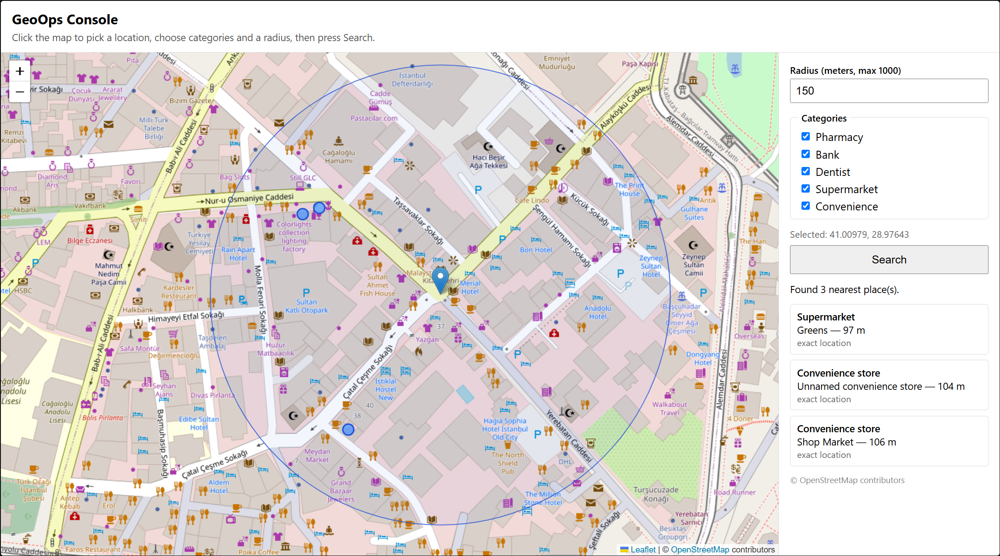
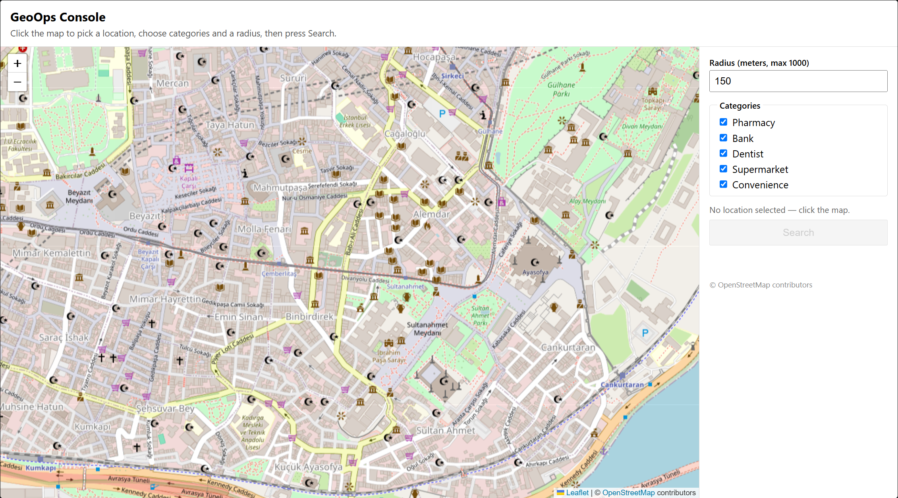
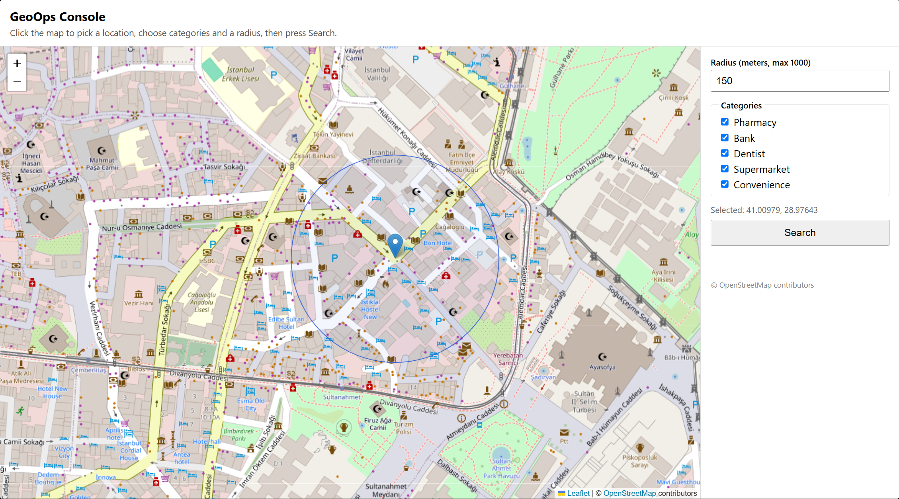
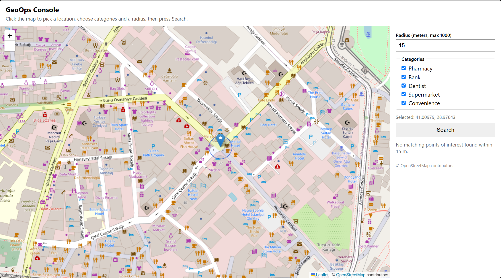
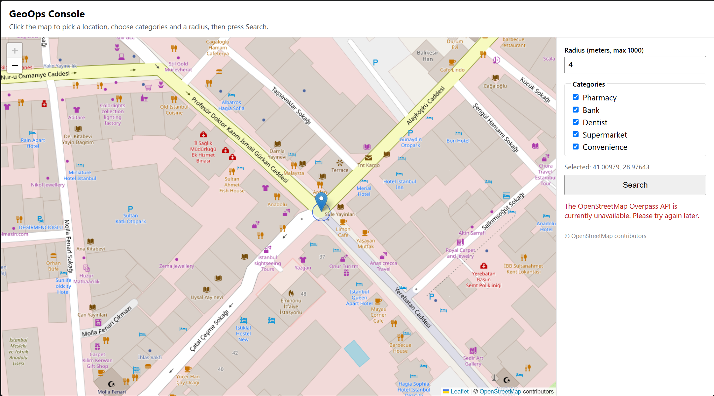

# GeoOps Console

**Live demo: [geoops.ozanhergul.com.tr](https://geoops.ozanhergul.com.tr/)**

A location-enrichment portfolio demo: pick a point on a map, and get back the
nearest real points of interest around it, sourced live from OpenStreetMap.

It demonstrates:

- Designing a small, safe public API around a third-party data source
  (server-built queries, never raw client input passed through).
- Correctly handling geospatial data quirks — OSM points vs. areas, exact vs.
  approximate coordinates, distance calculation and ranking.
- Being a good citizen of a shared public API: caching, timeouts, inbound
  rate limiting, and an outbound concurrency cap.
- A small full-stack pairing (Fastify API + a Leaflet map UI) with tests on
  both sides, kept intentionally free of unnecessary frameworks or infra.

This is a personal portfolio project. It uses only public OpenStreetMap
data — no proprietary datasets, credentials, or business logic.



## Stack & architecture

- **Shared enrichment core** (`src/schema.ts`, `enrichService.ts`, `osm/*`,
  `cache.ts`, `concurrencyLimiter.ts`): validation, Overpass query building,
  normalization/ranking, caching, and concurrency limiting — plain
  TypeScript using only Web-standard APIs (`fetch`, `AbortController`,
  `Promise`, `Map`). This same code runs **two different HTTP layers on
  top of it, unchanged**:
  - **Locally**: [Fastify](https://fastify.dev/) (`src/app.ts`,
    `src/routes/enrich.ts`), Node.js 20+.
  - **In production**: a small native Cloudflare Worker adapter
    (`worker/index.ts`) — see "Cloudflare Workers production deployment"
    below for why Fastify isn't used there.
- **Frontend**: [Vite](https://vitejs.dev/) + vanilla TypeScript +
  [Leaflet](https://leafletjs.com/). No React/Angular — the UI is small
  enough not to need one. Tested with Vitest (pure logic only). The exact
  same build (`frontend/dist`) is served locally and in production.
- **External dependency**: the public
  [OpenStreetMap Overpass API](https://overpass-api.de/), queried
  server-side only, from whichever HTTP layer is running.
- zod for validation, `@fastify/rate-limit` for the local backend's inbound
  limiting. Tested with Vitest against mocked Overpass responses (no
  network access required for tests).

```
Browser (Leaflet map + form)
   │  POST /api/enrich { latitude, longitude, radiusMeters, categories }
   ▼
Fastify (local dev)  ──or──  Cloudflare Worker (geoops.ozanhergul.com.tr)
   │  validate → build fixed-shape Overpass QL query → cache check   [same code, either way]
   ▼
Public Overpass API  (nodes / ways / relations, out center;)
   │
   ▼
Normalize + dedupe + rank → nearest 3 POIs   [same code, either way]
   │  JSON response (+ "approximate" flag for way/relation centroids)
   ▼
Frontend renders map markers + a result list
```

## Project structure

```
geoops-console/
├── src/                        # Backend (Fastify + TypeScript)
│   ├── server.ts               # Entry point
│   ├── app.ts                  # Fastify app: rate limiting, routes
│   ├── config.ts               # Central runtime config (limits, timeouts)
│   ├── schema.ts               # zod request validation
│   ├── enrichService.ts        # Cache + orchestration for /api/enrich
│   ├── cache.ts                # In-memory TTL cache
│   ├── concurrencyLimiter.ts   # Caps concurrent outbound Overpass calls
│   ├── osm/
│   │   ├── categories.ts       # Fixed POI category → OSM tag mapping
│   │   ├── overpass.ts         # Overpass query builder + HTTP client
│   │   └── normalize.ts        # Node/way/relation normalization & ranking
│   └── routes/enrich.ts        # POST /api/enrich handler
├── test/                       # Backend tests (Vitest, mocked Overpass)
├── frontend/                   # Frontend (Vite + vanilla TS + Leaflet)
│   ├── src/
│   │   ├── main.ts             # DOM wiring: form, search flow, state
│   │   ├── map.ts              # Leaflet map, markers, radius circle
│   │   ├── api.ts              # Fetch client for /api/enrich
│   │   ├── request.ts          # Radius clamping / request building (pure)
│   │   ├── format.ts           # Distance/label formatting (pure)
│   │   ├── requestGuard.ts     # Discards stale in-flight responses
│   │   ├── types.ts            # Mirrors the backend's request/response contract
│   │   └── constants.ts        # Mirrors the backend's categories/limits
│   ├── test/                   # Frontend unit tests (pure logic only)
│   └── vite.config.ts          # Dev-only proxy to the backend
├── worker/                     # Cloudflare Worker adapter (production runtime)
│   ├── index.ts                # fetch handler: reuses src/* logic directly
│   ├── rateLimiter.ts          # Per-isolate inbound rate limiter
│   └── tsconfig.json           # Typechecked against @cloudflare/workers-types
├── wrangler.toml                # Worker + static-assets config (frontend/dist)
├── docs/screenshots/           # Portfolio screenshots (see below)
├── Dockerfile, docker-compose.yml  # Backend container for local/demo use
├── PROJECT_BRIEF.md, DECISIONS.md  # Scope and decision log
└── README.md
```

## Screenshots

All captured from the running app, backend + frontend both local, no data
altered afterward.


*Initial view — the map loads centered on Sultanahmet, Istanbul; all five
categories are selected by default and the Search button is disabled until a
location is picked.*


*Location selected — the marker and the radius circle (here, 150 m) appear
immediately on click, before Search is even pressed.*


*Empty-result state — a 15 m radius here turns up nothing; handled with an
explicit message rather than an empty, unexplained list.*


*Upstream-unavailable state — if the public Overpass API is down or times
out, the UI says so plainly instead of retrying automatically or leaking a
raw error.*

## Requirements

- Node.js 20+
- Docker (optional, for containerized local backend dev)

## Backend: install, build, test, run

```bash
npm install
npm run build   # tsc
npm test        # vitest run — 41 tests, mocked Overpass, no network needed
npm run dev     # http://localhost:3000, hot reload (tsx watch)
```

Or with Docker:

```bash
docker compose up --build
```

## Frontend: install, build, test, run

The frontend is a separate project in [`frontend/`](frontend), with its own
`package.json`. With the backend running on `http://localhost:3000`:

```bash
cd frontend
npm install
npm run build   # tsc --noEmit + vite build (frontend/dist)
npm test        # vitest run — 15 tests, pure logic only, no browser needed
npm run dev     # http://localhost:5173, hot reload
```

The Vite dev server proxies `/api/*` to `http://localhost:3000`
(`frontend/vite.config.ts`), so the browser only ever talks to its own
origin — no CORS setup or API key needed for local development. To point a
production build at a different backend origin, set `VITE_API_BASE_URL` at
build time; it defaults to relative URLs (same-origin).

Click the map to select a location, adjust the radius/categories, and press
**Search**.

## Cloudflare Workers production deployment

**[geoops.ozanhergul.com.tr](https://geoops.ozanhergul.com.tr/) is live on
Cloudflare Workers**, over HTTPS (Cloudflare-managed certificate), serving
the built frontend as static assets plus a small native Worker adapter
(`worker/index.ts`) in place of Fastify for `/api/enrich`.

Everything under "Backend"/"Frontend" above (`npm run dev` + Docker Compose)
describes **local Node.js development** — the Fastify server, used for
day-to-day iteration. Production runs a second, independent way of serving
the exact same enrichment logic: **neither depends on the other**, and both
are kept working. If you run this project locally, you are running Fastify;
the live URL runs the Worker.

**Why not just run Fastify on Workers?** Verified against Cloudflare's own
documentation rather than assumed: as of this writing, Cloudflare's Node.js
compatibility layer supports Express and Koa, but
[explicitly does not yet support Fastify](https://blog.cloudflare.com/nodejs-workers-2025/)
("we're hoping to be able to add Fastify support later"). Workers also have
no real listening socket for `.listen()` to bind to — a Worker's entry point
is a `fetch(request)` function, not a server process.

**What was reused instead of rewritten:** `worker/index.ts` is a small
routing shim (~100 lines) that imports the *exact same* `src/schema.ts`
(zod validation), `src/enrichService.ts` (cache + concurrency-limited
orchestration), `src/osm/*` (query building, HTTP client, normalization),
`src/cache.ts` and `src/concurrencyLimiter.ts` used by the Node backend.
None of those modules use any Node-specific API — only `fetch`,
`AbortController`, `Promise`, and `Map` — so they run unmodified in the
Workers runtime, with **no `nodejs_compat` flag needed**. Only the
HTTP-framework glue (routing, request/response mapping, rate limiting) is
Workers-specific.

### Local Wrangler setup

```bash
npm install                      # adds wrangler + @cloudflare/workers-types (devDependencies)
npm run cf:typecheck             # tsc -p worker/tsconfig.json
cd frontend && npm run build && cd ..   # produces frontend/dist for [assets]
npm run cf:dev                   # wrangler dev — real local Workers runtime (workerd), no deploy
```

Then, with `wrangler dev` running:

```bash
curl http://127.0.0.1:8787/health
curl -X POST http://127.0.0.1:8787/api/enrich \
  -H "Content-Type: application/json" \
  -d '{"latitude":41.008241,"longitude":28.973577,"radiusMeters":150,"categories":["pharmacy","bank"]}'
```

`npm run cf:deploy` (`wrangler deploy`) publishes to the live Worker — this
requires `wrangler login` under the account that owns
`geoops.ozanhergul.com.tr` first, and is a deliberate, manual step (not run
as part of any automated build/test command in this repo).

### Observability: where to view logs

`wrangler.toml`'s `[observability]` block enables
[Workers Logs](https://developers.cloudflare.com/workers/observability/logs/workers-logs/)
(included at no extra cost on the Free plan): `enabled = true` with
`[observability.logs] enabled = true, invocation_logs = true` records each
invocation (method, path, status, duration, CPU time) for viewing in the
Cloudflare dashboard under **Workers & Pages → geoops-console → Logs**.
`[observability.traces] enabled = false` — tracing is off; no external
monitoring/APM service was added.

Two distinct things are worth separating here: **application-level
logging** and **Cloudflare's platform invocation metadata** are not the
same thing. `worker/index.ts` contains no `console.log` calls at all — the
application itself logs nothing. Separately, and regardless of that,
Cloudflare's platform automatically records invocation metadata (method,
path, status, duration, CPU time) for every request whenever Workers Logs
is enabled — that automatic record is what appears in the dashboard, not
anything the application code emits. Combined, this means **no request
bodies, coordinates, personal information, credentials, or full Overpass
responses are logged**, by either mechanism.

### Free-plan limits and caveats (verified, not assumed)

- **10ms CPU time per request** on Workers Free (confirmed via Cloudflare's
  own limits page). CPU time excludes time spent waiting on `fetch()` —
  which is most of this handler's wall-clock time — so JSON parsing, zod
  validation, and normalization are the only real CPU cost. Given how
  little of that there is, this is *expected* to fit comfortably within
  10ms — but that is a reasoned expectation based on the code's shape, not
  a measured guarantee: it has **not been independently benchmarked in
  production**. If this ever becomes a concern, Workers Logs (above)
  reports per-invocation CPU time and is the way to check.
- **In-memory cache, rate limiting, and outbound concurrency are scoped to a
  single Worker isolate — they are NOT globally shared or distributed
  across instances.** Cloudflare may run multiple isolates for the same
  Worker concurrently, worldwide, and can recycle any of them at any time.
  So in production, two requests hitting different isolates get
  independent caches, independent rate-limit counters, and independent
  concurrency counts — this is a best-effort, per-isolate optimization,
  never a distributed cache or a guaranteed platform-wide rate limit (same
  idea as the Node backend's own "per-process" caveat, just with more,
  shorter-lived instances). See `DECISIONS.md` for what a real fix would
  require (Cloudflare's own Rate Limiting rules, KV, or Durable Objects —
  none added here; this app is a low-traffic public demo, not a system that
  needs them).
- **100,000 requests/day and 50 subrequests/request** on the Free plan
  (this app makes exactly one subrequest — to Overpass — per `/api/enrich`
  call).
- **Public Overpass is a shared, best-effort community resource** — this
  demo does not have, and does not claim, any special quota. The same
  identifiable User-Agent is preserved from the Node deployment, there is no
  automatic endpoint rotation, and no aggressive/automatic retries in
  either deployment. Kept intentionally low-traffic and demo-scale; this is
  not a pattern to scale up without first talking to Overpass's operators.
- No CORS was added or is needed: the Worker and the static frontend are
  served from the same origin, so `/api/enrich` stays a same-origin,
  relative-URL call exactly as in local dev.

## Example request

Coordinates below are Sultanahmet, Istanbul:

```bash
curl -X POST http://localhost:3000/api/enrich \
  -H "Content-Type: application/json" \
  -d '{
    "latitude": 41.008241,
    "longitude": 28.973577,
    "radiusMeters": 200,
    "categories": ["pharmacy", "supermarket", "convenience", "bank"]
  }'
```

Example response:

```json
{
  "pois": [
    {
      "osmType": "node",
      "osmId": 123456789,
      "category": "pharmacy",
      "name": "Example Pharmacy",
      "latitude": 41.008241,
      "longitude": 28.973577,
      "distanceMeters": 24,
      "source": "openstreetmap",
      "approximate": false
    }
  ],
  "attribution": "© OpenStreetMap contributors"
}
```

`categories` is optional; omitting it searches all five supported categories
(`pharmacy`, `bank`, `dentist`, `supermarket`, `convenience`). `radiusMeters`
defaults to 50 and is capped at 1000.

## How it works

- Requests are validated (coordinate ranges, radius cap, category enum)
  before any Overpass query is built. Queries are assembled server-side from
  a fixed category → OSM tag mapping — the client can never inject arbitrary
  Overpass syntax.
- Nodes, ways and relations are all queried (`out center;`), since a POI can
  be mapped as any of the three. Ways/relations only carry a centroid, not
  their true shape, so those results are marked `"approximate": true` (shown
  as "approximate centroid" in the UI, on both markers and the result list).
- Results are deduplicated, sorted by distance, and **only the closest three
  are returned** — this is a fixed, non-configurable limit.
- Responses are cached in-memory for 10 minutes per (coordinate, radius,
  categories) key, to reduce load on the public Overpass instance.
- Inbound requests to `/api/enrich` are rate-limited (20/min by default);
  outbound Overpass calls are separately capped at 2 concurrent requests
  application-wide, each with an 8-second timeout.

## Known limitations

- **Public Overpass is a best-effort dependency**, not a guaranteed service.
  There is no quota, uptime SLA, or response-time guarantee from
  `overpass-api.de`. Upstream failures surface as `502 upstream_unavailable`
  rather than crashing the service, and the UI does not auto-retry.
- **Only the nearest three POIs are ever returned**, by design — this is a
  demo of the enrichment pattern, not a full search/listing API.
- **Way/relation distances are centroid-based approximations**, not true
  nearest-edge distances. Flagged explicitly (`approximate: true`) rather
  than presented as exact.
- **In-memory cache and rate limiter are per-process** and reset on
  restart — correct for a single-instance demo, not for horizontal scaling
  or multiple backend replicas.
- **No database or authentication.**

## Attribution

Point-of-interest data © [OpenStreetMap](https://www.openstreetmap.org/copyright)
contributors, made available under the Open Database License (ODbL).

## AI-assisted development

This project was built with AI pair-programming (Claude Code), under my
direction: I defined the requirements and scope for each milestone, reviewed
the generated code and architecture decisions, and manually tested the
running application — including live requests against the public Overpass
API — before accepting each change. Design tradeoffs and their rationale are
recorded in [`DECISIONS.md`](DECISIONS.md).
